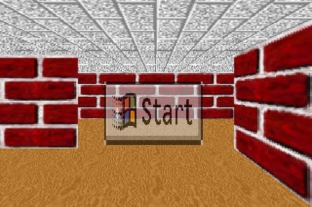

### **‎ ‎ ‎**

### **[(To my Profile Page)](https://github.com/oveeauki)**

<link rel="shortcut icon" type="image/x-icon" href="favicon.ico"/>



[](https://github.com/oveeauki)
```
Hi! Im Elias. Linux enthusiast, Programming and infosec hobbyist.
I mainly code C & JavaScript but have knowledge in other langs aswell.
I have also interests in mental health advocation, traveling & exploring, biochemistry, SDR radio,
micro controller tinkering, farmacology,
music etc... and i also like long guitar playing sessions while absolutely blasted on acid!
```

 


<p align="left"> <a href="https://en.cppreference.com/w/c/language" target="_blank"> </a> <a href="https://discordapp.com/users/300648311067508754/" target="_blank"></a> <a href="https://archlinux.org" target="_blank"></a> <a href="https://www.javascript.com/" target="/"></a> <a href="filltwitter" target="/"> </a> <a href="https://tryhackme.com/p/oveeauki" target="/"></a></p>
 
```
[00:00:00] fredi :: index  ➜  ~ » tux

                                                                 #####
                                                                #######
                   #                                            ##O#O##
  ######          ###                                           #VVVVV#
    ##             #                                          ##  VVV  ##
    ##         ###    ### ####   ###    ###  ##### #####     #          ##
    ##        #  ##    ###    ##  ##     ##    ##   ##      #            ##
    ##       #   ##    ##     ##  ##     ##      ###        #            ###
    ##          ###    ##     ##  ##     ##      ###       QQ#           ##Q
    ##       # ###     ##     ##  ##     ##     ## ##    QQQQQQ#       #QQQQQQ
    ##      ## ### #   ##     ##  ###   ###    ##   ##   QQQQQQQ#     #QQQQQQQ
  ############  ###   ####   ####   #### ### ##### #####   QQQQQ#######QQQQQ


[00:00:01] fredi :: index  ➜  ~ » 
```


